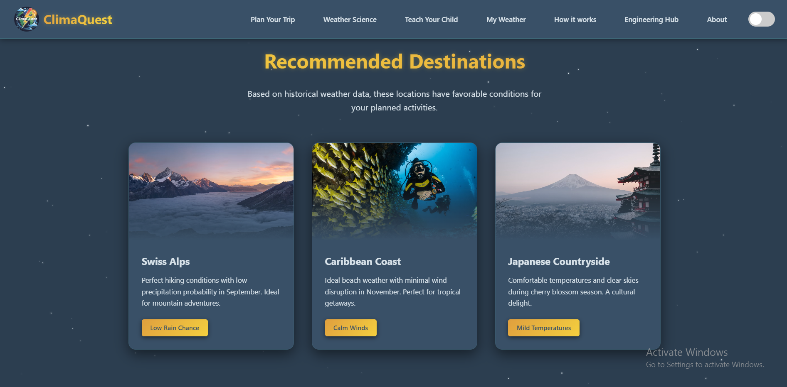
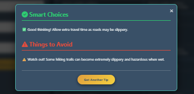
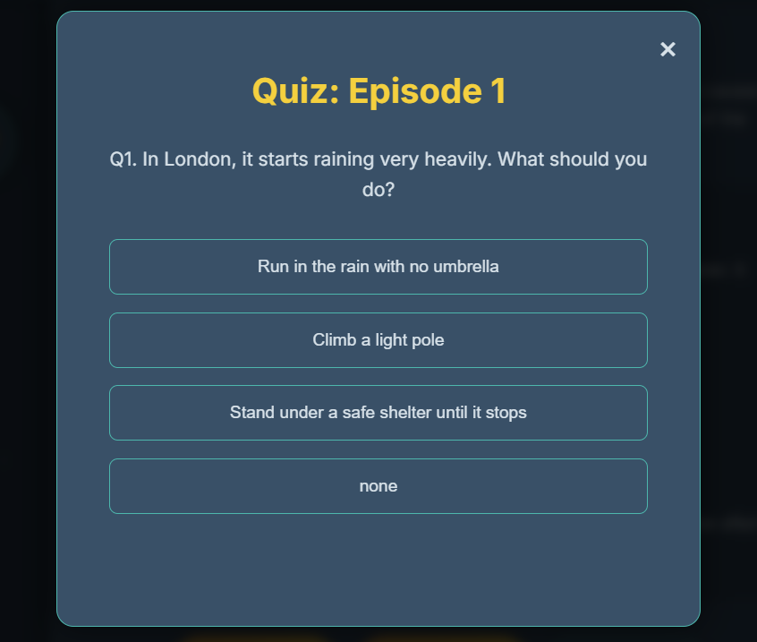
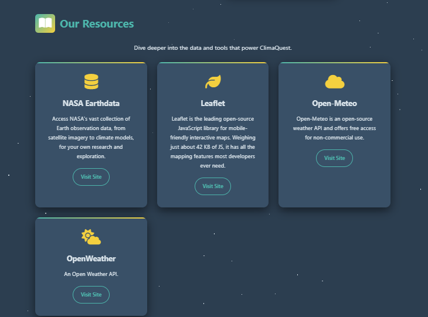
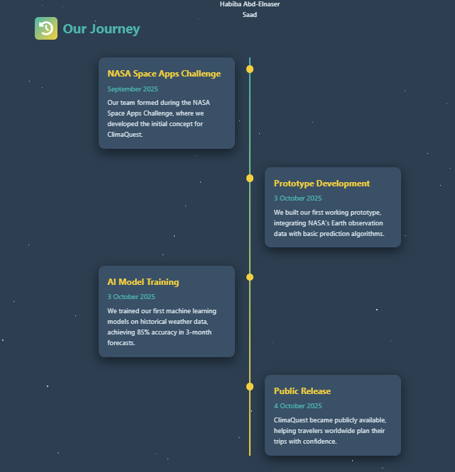

<p align="center">
  
</p>

<h1 align="center">🌦️ ClimaQuest</h1>
<h3 align="center">Will It Rain On My Parade?</h3>

<p align="center">
An AI-powered weather platform built for the <b>NASA Space Apps Challenge</b>, using NASA's historical Earth observation data to help people plan outdoor activities, learn about weather science, teach kids about climate, and support engineers with location-based climate risk data.
</p>

<p align="center">
  
  
  
  
  
  
</p>

<p align="center">
  <a href="https://drive.google.com/file/d/1QwpGr2r4ObSYYrQ4BtXvHurWlWo2m6Pg/view?usp=drive_link">
    
  </a>
  &nbsp;
  <a href="https://climaquest.netlify.app/">
    
  </a>
</p>

<p align="center">
  <i>🎥 Recorded in the very first stage of the project, this overview explains <b>why ClimaQuest matters</b> — the problem we set out to solve and the vision behind combining NASA data, AI predictions, and climate education in one platform.</i>
</p>

---

## 📖 About the Project

ClimaQuest is more than a weather app — it's a full platform that combines:

- **Trip planning** based on historical weather-probability data (not just a 5-day forecast)
- **Weather science & analytics**, explained with real charts and prediction algorithms
- **An interactive learning path for kids**, teaching them about weather phenomena through story episodes, quizzes, and tips
- **A 10-day weather forecast** for the user's current location
- **An Engineering Hub** for climate-aware construction/material decisions in different cities
- **Dark / Light mode** across every page, saved in the browser

The platform is powered by real open data sources: **NASA Earthdata**, **Open-Meteo**, **OpenWeather**, and **Leaflet** for maps.

<p align="center">
  <a href="#-features--pages-with-screenshots">Features</a> •
  <a href="#-tech-stack">Tech Stack</a> •
  <a href="#-project-structure">Structure</a> •
  <a href="#-getting-started">Getting Started</a> •
  <a href="#-team">Team</a>
</p>

---

## ✨ Features & Pages (with Screenshots)

### 🏠 Home Page

The landing page introduces the project's core question — *"Will It Rain On My Parade?"* — and explains that ClimaQuest uses NASA's historical weather data to predict the likelihood of bad conditions for any location and date. Available in both dark and light mode.

<p align="center">
  
  <br/><i>Home page — Dark mode</i>
</p>

<p align="center">
  
  <br/><i>Home page — Light mode</i>
</p>

The **"Why Choose ClimaQuest?"** section summarizes every major feature of the site in one place: NASA-powered data, location intelligence, historical trend charts, the kids' learning section, the 10-day forecast, weather science, and the Engineering Hub.

<p align="center">
  
  <br/><i>Feature overview grid</i>
</p>

The Home page also recommends destinations with favorable weather conditions based on historical data.

<p align="center">
  
  <br/><i>Recommended destinations based on historical weather patterns</i>
</p>

A **"How It Works"** modal breaks the process into 3 simple steps: select a location, set a date range, and get probability-based insights (with a downloadable report).

<p align="center">
  
  <br/><i>How It Works — 3-step explanation</i>
</p>

---

### 🧭 Plan Your Trip (Explore Weather)

Users pick a destination on an **interactive Leaflet map** (or type a place name), which auto-fills the latitude/longitude.

<p align="center">
  
  <br/><i>Interactive map for selecting a destination</i>
</p>

Then they choose a start/end date and a trip type (Business, Vacation, Adventure, Relaxation):

<p align="center">
  
  <br/><i>Selecting travel dates and trip type</i>
</p>

The results panel shows the probability of extreme conditions (Very Hot, Very Cold, Strong Winds, Severe Rain) for the selected period, plus a **day-by-day forecast** with temperature, wind speed, and humidity:

<p align="center">
  
  <br/><i>Weather probability results & daily forecast breakdown</i>
</p>

Users can also request **smart, AI-style travel advice** (what to do / what to avoid) based on the forecast:

<p align="center">
  
  <br/><i>"Smart Choices" travel advice popup</i>
</p>

---

### 🔬 Weather Science & Analytics

This page explains the science behind the forecasting system. The **Prediction Methodology** section walks through Data Collection → Data Processing → AI Modeling, each with the actual math formula used:

<p align="center">
  
  <br/><i>Prediction methodology: data collection, processing, and AI modeling</i>
</p>

It continues into the **Prediction Generation** stage, describing the probabilistic and ensemble forecasting techniques used:

<p align="center">
  
  <br/><i>Prediction generation stage of the pipeline</i>
</p>

A live analytics dashboard lets users pick a location, year, and metric (e.g. Temperature) to see **historical vs. predicted trends**, plus quick stats (average temperature, precipitation chance, wind speed, comfort index):

<p align="center">
  
  <br/><i>Temperature trends & predictions dashboard (Chart.js)</i>
</p>

Below that, four more charts cover **weather condition distribution, precipitation trends, humidity patterns, and wind direction/speed** — each with a plain-language explanation of what it means:

<p align="center">
  
  <br/><i>Weather condition distribution, precipitation, humidity, and wind analysis</i>
</p>

Finally, a **"Prediction Algorithms & Equations"** carousel documents the actual math models used (Time Series/ARIMA, Neural Networks, Ensemble Methods, and more), each with its formula and a short explanation:

<p align="center">
  
  
  <br/><i>Prediction algorithms carousel: Time Series (ARIMA), Neural Networks, Ensemble Methods</i>
</p>

---

### 📅 My Weather

A **10-day weather forecast** for the user's detected location (Cairo, Egypt in this example), showing max/min temperature, wind speed and humidity per day, plus a summary of the odds of Hot/Windy/Humid/Rainy conditions:

<p align="center">
  
  <br/><i>10-Day Weather Forecast page</i>
</p>

---

### 👨‍👩‍👧 Teach Your Child (Cosmic Learning Journey)

An interactive, story-driven course that teaches kids about weather phenomena one episode at a time. Each chapter starts with a short animated video:

<p align="center">
  
  <br/><i>Chapter video: "Teach Your Child – First Episode: Rainy Weather"</i>
</p>

<p align="center">
  <a href="https://drive.google.com/file/d/1HpYnkRvfyEDZBnqUhA5OS-tsIy2q1kwx/view?usp=drive_link">
    
  </a>
  <br/><i>See a full animated episode in action — the story, the narration, and the safety tips kids learn along the way.</i>
</p>

...followed by a kid-friendly explanation and safety tips for that weather type:

<p align="center">
  
  <br/><i>Chapter summary with simple, kid-friendly safety tips</i>
</p>

Kids can test what they learned with a short quiz at the end of each chapter:

<p align="center">
  
  <br/><i>End-of-chapter quiz</i>
</p>

The whole course is framed as a **"Learning Journey"** map that the child follows step by step:

<p align="center">
  
  <br/><i>"Your Learning Journey" — intro to the exploration path</i>
</p>

...and ends with a congratulations screen once all chapters are completed:

<p align="center">
  
  <br/><i>Completion screen after finishing the learning path</i>
</p>

---

### ⚙️ Engineering Hub

Built for engineers and planners, this hub lets users pick a city and get **climate-aware construction insights**.

**Geotechnical Assessment** — seismic hazard level and predominant soil type, with the option to export the data as CSV or PDF:

<p align="center">
  
  <br/><i>Geotechnical assessment + CSV/PDF export</i>
</p>

**Hydrological Insights & Renewable Energy Potential** — soil moisture, evapotranspiration, groundwater stress, drought risk, and solar/wind energy potential for the selected city:

<p align="center">
  
  <br/><i>Hydrological insights and renewable energy potential</i>
</p>

**Material Warnings & Climate Risk Assessment** — flags unsuitable materials (e.g. wood warping in extreme heat) and shows risk levels for heat days, aerosol index, flood events, and UV index:

<p align="center">
  
  <br/><i>Material warnings and climate risk assessment</i>
</p>

Users select from a list of major world cities (Cairo, Dubai, Tokyo, London, New York, etc.):

<p align="center">
  
  <br/><i>City selector for the WeatherWise Engineering Hub</i>
</p>

The core of the hub is the **Material Recommendations table**, scoring building materials (Concrete, Glass, Steel, Stone) on durability, eco-friendliness, cost, lifespan, carbon footprint, availability, resilience, and local regulations — and picking the best overall option per city:

<p align="center">
  
  <br/><i>WeatherWise Engineering Hub — material recommendations table</i>
</p>

---

### 📚 Our Resources

A dedicated section crediting and linking to the real open data & tools that power ClimaQuest:

<p align="center">
  
  <br/><i>NASA Earthdata, Leaflet, Open-Meteo, and OpenWeather</i>
</p>

| Resource | Role in the project |
|---|---|
| **NASA Earthdata** | Source of satellite/Earth observation data used for historical weather probabilities |
| **Leaflet** | Powers the interactive maps on the Plan Your Trip page |
| **Open-Meteo** | Free open-source weather API |
| **OpenWeather** | Additional open weather API |

---

### ℹ️ About ClimaQuest

Includes a video tutorial on how to use the platform, and the team's mission statement built around three pillars: NASA data integration, AI-powered predictions, and global accessibility.

<p align="center">
  
  <br/><i>About page — tutorial video & mission</i>
</p>

**Our Journey** — a timeline of the project's milestones, from forming the team at the NASA Space Apps Challenge to building the prototype, training the AI model, and the public release:

<p align="center">
  
  <br/><i>Project timeline: from NASA Space Apps Challenge to public release</i>
</p>

**Meet Our Team** — the people behind ClimaQuest:

<p align="center">
  
  <br/><i>Mariam Mohammed Omran · Mariam Mohammed Ramadan · Mariam Sameh Yasin · Fatma Mohammed Fathy · Shimaa Abd-ElAziz Ahmed · Habiba Abd-Elnaser Saad</i>
</p>

---

## 🛠️ Tech Stack

<p align="center">
  
  
  
  
  
  
  
  
  
</p>

| Layer | Tools |
|---|---|
| 🧱 Structure & Style | **HTML5 / CSS3** — built with CSS variables for full Dark/Light theming |
| ⚡ Interactivity | **JavaScript (Vanilla JS)** — theme switching, interactivity, and data logic |
| 📊 Charts | **[Chart.js](https://www.chartjs.org/)** — temperature trends, precipitation, humidity, wind, distribution |
| 🗺️ Maps | **[Leaflet.js](https://leafletjs.com/)** — interactive maps for trip planning |
| ✨ Effects | **[Particles.js](https://vincentgarreau.com/particles.js/)** — animated particle background on the Weather Science page |
| 📄 Export | **[jsPDF](https://github.com/parallax/jsPDF) + jsPDF-AutoTable** — Engineering Hub PDF reports |
| 🎨 Icons & Type | **[Font Awesome](https://fontawesome.com/)** + **Google Fonts (Inter)** |
| 🛰️ Data | **NASA Earthdata**, **Open-Meteo**, **OpenWeather** |

---

## 📁 Project Structure

```
Nasa/
├── index.html                 # Home page
├── about.html                 # About Us page
├── exploreweather.html        # Plan Your Trip page
├── weathersience.html         # Weather Science & Analytics page
├── teachyourchild.html        # Kids' learning journey page
├── myweather.html             # 10-day forecast page
├── engineeringhub.html        # Engineering Hub page
├── scripts/
│   ├── homepage.js            # Home page logic + theme switcher
│   └── weathersience.js       # Charts, particles, theme logic
├── styles/
│   ├── homepage.css
│   ├── weathersience.css
│   └── nav.css
└── pics/
    ├── logo.jpg
    ├── van.jpg
    └── final about.mp4
```

---

## 🚀 Getting Started

This is a static front-end project — no build step or package installation required.

1. Download / unzip the project files
2. Open `index.html` directly in your browser

**Or** run it with a local server (recommended, to avoid asset-loading issues):

 

```bash
python3 -m http.server 8000
```


```bash
npx live-server
```

Then open:
```
http://localhost:8000
```

> ⚠️ **Note:** The project loads some libraries from CDNs (Chart.js, Leaflet, Font Awesome), so an internet connection is required while running it.

---

## 👥 Team

<p align="center">
  
</p>

Developed for the **NASA Space Apps Challenge** by:

| Team Member | Team Member |
|---|---|
| Mariam Mohammed | Fatma Mohammed Fathy |
| Mariam Mohammed Ramadan | Shimaa Abd-ElAziz Ahmed |
| Mariam Sameh Yasin | Habiba Abd-Elnaser Saad |

<p align="center">
  <a href="mailto:ClimaQuest.team@gmail.com">
    
  </a>
</p>

---

## 📄 License

<p align="center">
  
</p>

This project was built for educational / competition purposes as part of the NASA Space Apps Challenge.

<p align="center">
  Made with 💙 for a safer, more climate-aware world — <b>ClimaQuest</b>
</p>
